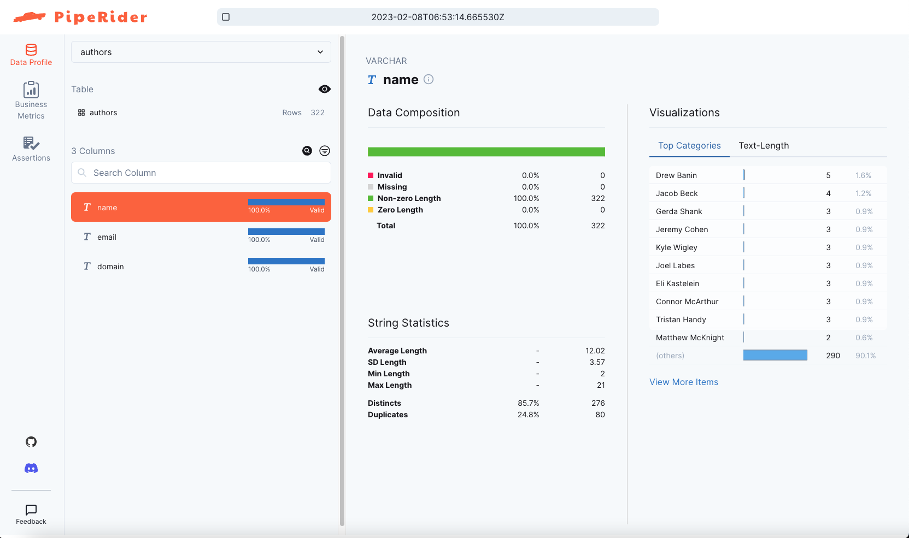
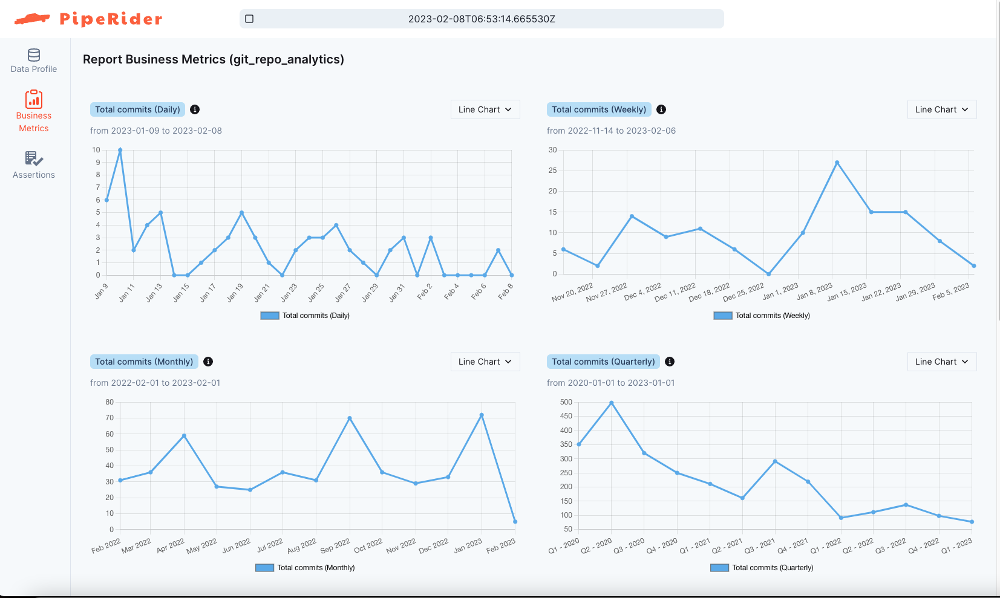

# Introduction

This is a demo project for [PipeRider](https://github.com/InfuseAI/piperider). It demonstrates how to use [dbt](https://www.getdbt.com/)+[duckdb](https://duckdb.org/)+[PipeRider](https://github.com/InfuseAI/piperider) to generate a git repository analytics report.

# Usage

1. Clone this repo
    ```
    git clone git@github.com:InfuseAI/git-repo-analytics.git   
    ```
1. Clone the git repo for analysis
    ```
    cd git-repo-analytics
    git clone git@github.com:dbt-labs/dbt-core.git git_repo
    ```
1. Install python package
    ```
    python -m venv ./venv
    source ./venv/bin/activate
    pip install -r requirements.txt     
    ```
1. Generate the db file from the repo. 
    ```
    python read_git_repo.py       
    ```
    The file `git_repo.duckdb` is generated

1. Run dbt
    ```
    dbt deps
    dbt build
    ```    
1. Run piperider
    ```
    piperider run --dbt-state ./target
    ```
1. Open the report from the command output

# Screenshots



