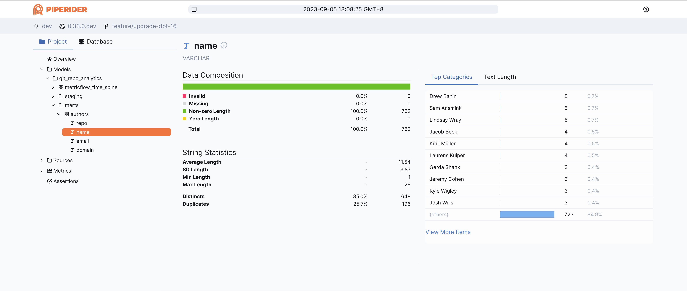

# Introduction

This is a demo project for [PipeRider](https://github.com/InfuseAI/piperider). It shows how you can use [dbt](https://www.getdbt.com/)+[duckdb](https://duckdb.org/)+[PipeRider](https://github.com/InfuseAI/piperider) to transform and query data efficiently. With these tools, you can generate a report that gives you insights into your git projects.

# Usage

1. Clone this repo
    ```
    git clone git@github.com:InfuseAI/git-repo-analytics.git   
    ```
1. Prepare git repositories repo for analysis by editing the `repos.csv`

    The format of the `repos.csv` file is as follows:
    ```
    name,repo
    dbt-core,dbt-labs/dbt-core
    duckdb,duckdb/duckdb
    PipeRider,InfuseAI/piperider
    ```
1. Install python package
    ```
    python -m venv ./venv
    source ./venv/bin/activate
    pip install -r requirements.txt     
    ```
1. Generate the db file from the repo. 
    ```
    make fetch
    make load
    ```

    The file `git_repo.duckdb` is generated under `./data`

1. Run dbt
    ```
    make transform
    ```    
1. Generate report
    ```
    make report
    ```
1. Run piperider
    ```
    make piperider
    ```

You can either run step-by-step from step4 to step7 or simply do one command
```
make
```

# Screenshots


